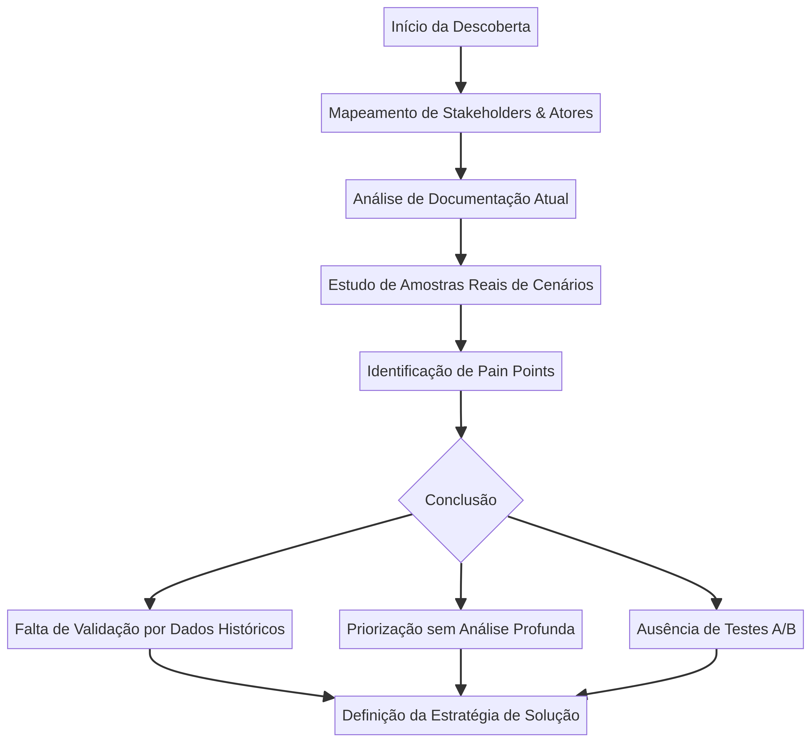
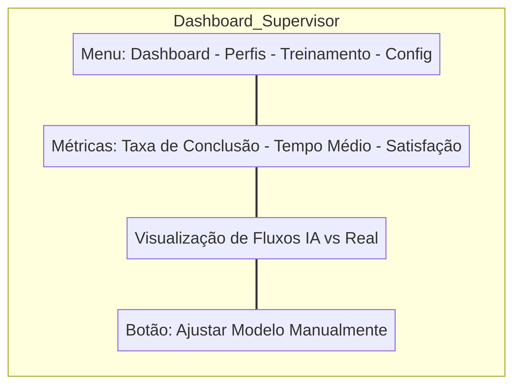

# Otimização de Suporte Global: Redução de 36% no Abandono de Chatbot Através de Modelos de IA

## Visão Geral (Executive Summary)

Como Gerente de Produto Sênior, liderei uma iniciativa estratégica para reverter a ineficiência crítica no serviço de atendimento via chatbot de uma **empresa multinacional de tecnologia** (informações confidenciais protegidas por NDA). O desafio central era a alarmante taxa de **84% de chats encerrados pelos usuários antes da resolução do problema**, resultando em uma sobrecarga insustentável para os agentes humanos e um alto custo operacional.

Minha abordagem focou em uma profunda análise do processo de criação e validação de fluxos de chat, culminando na proposição e implementação de uma solução baseada em **Inteligência Artificial (IA)**. O resultado inicial foi uma **melhoria de 36% na performance do chatbot**, demonstrando o impacto direto de uma gestão de produto orientada por dados e inovação.

| Métrica | Antes da Intervenção | Após Testes Iniciais | Impacto |
| :--- | :--- | :--- | :--- |
| Taxa de Abandono (Pré-Resolução) | 84% | ~54% | Redução de 36% |
| Sobrecarga de Agentes Humanos | Alta | Moderada | Otimização de Tempo |
| Validação de Fluxos | Intuitiva/Manual | Orientada por IA e Dados | Maior Assertividade |

## O Problema (The Challenge)

O serviço de suporte via chatbot, embora projetado para escalar o atendimento, estava atuando como um gargalo. A alta taxa de abandono (84%) indicava que os usuários estavam frustrados com a incapacidade do bot de resolver suas questões, forçando-os a buscar o agente humano.

O problema não estava apenas na tecnologia do chatbot, mas fundamentalmente no **processo de gestão do produto**. A equipe de suporte e conteúdo dedicava um esforço considerável na criação e expansão de novos fluxos de chat, mas a definição de quais fluxos priorizar era baseada em intuição ou demanda imediata, e não em uma análise rigorosa de dados históricos de falha ou comportamento do usuário. Além disso, a validação desses novos fluxos ocorria diretamente em produção, sem um mecanismo de **A/B testing** robusto, expondo os usuários a experiências subótimas.

## Processo de Descoberta (Discovery & Research)

Para diagnosticar a raiz do problema, iniciei um processo de descoberta estruturado, mapeando todas as fases, interações, *stakeholders* e atores envolvidos na jornada do chat e na gestão de conteúdo.

> "A ineficiência estava mascarada por um alto volume de trabalho. A equipe estava ocupada criando, mas não estava criando o que realmente importava para o usuário."

O fluxo de trabalho de descoberta revelou as falhas críticas no ciclo de vida do produto:

**Principais Pain Points Identificados:**
1.  **Falta de Validação de Demanda:** A priorização de novos fluxos não era validada por dados históricos de abandono ou de conversão.
2.  **Validação em Produção:** A ausência de um ambiente de *testing* adequado levava à validação de fluxos diretamente no ambiente do cliente, impactando negativamente a experiência.
3.  **Desconexão com o Usuário:** Não havia um mecanismo para identificar o perfil do usuário (ex: técnico, não-técnico) e adaptar a linguagem ou o fluxo de suporte.

## A Solução (The Solution)

A solução proposta foi a introdução de dois **Modelos de Inteligência Artificial** e a criação de uma **Interface de Gestão** para capacitar a equipe de suporte e garantir o ciclo de feedback humano no treinamento da IA.

### 1. Modelo de Revisão e Otimização de Fluxos (Flow Optimization AI)
Este modelo foi treinado com o histórico de chats, focando em:
*   **Identificação de Gaps:** Analisar onde os usuários mais abandonavam o chat e cruzar com a ausência de fluxos de suporte para aqueles tópicos.
*   **Sugestão de Melhorias:** Propor ajustes em fluxos existentes ou a criação de novos, com base na probabilidade de sucesso (conversão) e na redução de *handoff* para agentes humanos.

### 2. Modelo de Perfilamento de Usuário (User Profiling AI)
Este modelo analisa a primeira mensagem do usuário para determinar seu perfil (ex: *techno-knowledgeable*, *non-technical*, *frustrated*).
*   **Redirecionamento Dinâmico:** O chatbot passa a adaptar a linguagem, a profundidade das perguntas e o fluxo de suporte imediatamente, aumentando a relevância e a chance de resolução.

O mapa mental abaixo resume os problemas e as soluções implementadas:

## Implementação e Iteração

Para garantir a adoção e o treinamento contínuo dos modelos de IA, desenvolvemos uma **Web Interface** dedicada aos supervisores humanos. Esta interface não era apenas um painel de métricas, mas uma ferramenta de **Human-in-the-Loop (HITL)**.

**Funcionalidades Chave da Interface:**
*   **Monitoramento de Métricas:** Acompanhamento em tempo real da taxa de conclusão, tempo médio de chat e satisfação.
*   **Criação de Perfis:** Capacidade de criar novos perfis de usuário (ex: "Usuário Corporativo", "Pequeno Empresário") e associá-los a fluxos específicos.
*   **Treinamento Manual:** Supervisores podiam revisar chats onde a IA falhou no perfilamento ou na sugestão de fluxo e corrigir manualmente, alimentando o modelo com dados de alta qualidade.

## Resultados e Próximos Passos

Os testes iniciais, focados nos fluxos de maior volume e abandono, resultaram em uma **melhoria de 36% na taxa de conclusão do chatbot**. Isso não apenas liberou a capacidade dos agentes humanos para problemas mais complexos, mas também melhorou significativamente a experiência do cliente.

O próximo passo no *roadmap* é a **integração com a ferramenta de CRM** da empresa. Isso permitirá importar dados valiosos como histórico de suporte, informações do dispositivo do usuário e dados demográficos. O enriquecimento do *dataset* com estas informações externas permitirá um treinamento mais sofisticado dos modelos de IA, refinando o perfilamento de usuário e a precisão das sugestões de fluxo, visando a meta de **reduzir a taxa de abandono para menos de 10%**.

Este projeto exemplifica a aplicação de **Product Management Sênior** para resolver problemas de negócio complexos, utilizando análise de processo, tecnologia de ponta (IA) e um design de produto centrado no ciclo de feedback humano.
